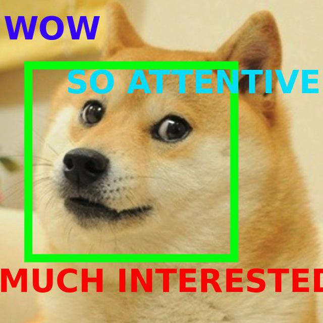

**[The Idea](#the-idea)** |
**[Technical Overview](#technical-overview)** |
**[Setup](#setup)** |
**[With Docker](#with-docker)**

## Boremeter

*Open source app for tracking auditory boredom on video*

---

## The Idea

In the current project we develop a framework for video analysis of public presentations and events. Given a video, this tool tracks viewers attention during lectures or presentations.

With this app you can assess speaker’s skills or detect the most resonant parts of a presentation, or give a summary of some socio-demographic statistics such as age and gender distribution without conducting surveys.



[slides](https://docs.google.com/presentation/d/14mCydv-_sYkVHxImUnIX6PWRfpsfL49311rG099QPvc/edit#slide=id.g19ead2f26b_0_16)

[People tracking example video](https://www.youtube.com/watch?v=LFJhAiqAA3c)

## Technical overview

The boremeter pipeline includes four main components:

- Faces detection
- Faces tracking
- Faces recognition
- Generating report & visualising results

For faces detection we use fast and robust Viola-Jones algorithm. 

*More on Viola-Jones algorithm you can read in original [paper](https://www.vision.caltech.edu/html-files/EE148-2005-Spring/pprs/viola04ijcv.pdf)*

Faces tracking is implemented using sparse optical flow and Lucas–Kanade method. 

*You can find out more in [Lucas-Kanade in a Nutshell](http://www.inf.fu-berlin.de/inst/ag-ki/rojas_home/documents/tutorials/Lucas-Kanade2.pdf)*

On the recognition stage we use [Caffe framework](http://caffe.berkeleyvision.org) and pre-trained convolutional neural networks from to exract age and gender from cropped images of detected faces. The pre-trained models are taken from http://howhot.io project.

The output of the pipeline is a rendered HTML file which contains:

- graphs of percentage of people interested in the presentation over time
- gender representation
- age representation

Boremeter can also visualize detection results and output an .avi video file with detected faces.

## Setup

### Check prerequisites

+ Ubuntu 14.04 or older (or OS X)
+ Python 2.7
+ [caffe](https://github.com/BVLC/caffe)
+ OpenCV3

Download pre-trained caffe nets and save them locally to {caffe_root}/models:

- [age.prototxt](https://data.vision.ee.ethz.ch/cvl/rrothe/imdb-wiki/static/age.prototxt)
- [age.caffemodel](https://data.vision.ee.ethz.ch/cvl/rrothe/imdb-wiki/static/dex_imdb_wiki.caffemodel)
- [gender.proto](https://data.vision.ee.ethz.ch/cvl/rrothe/imdb-wiki/static/gender.prototxt)
- [gender.caffemodel](https://data.vision.ee.ethz.ch/cvl/rrothe/imdb-wiki/static/gender.caffemodel)

### Install package

To install boremeter just run

```bash
$ git clone https://github.com/walterdd/Boremeter.git
$ cd Boremeter
$ python setup.py install
```

### Use boremeter from command line

```bash
boremeter --file={input video file path}
```

To find out more about boremeter usage

```bash
boremeter --help
```

## With Docker

We strongly suggest you to run boremeter in [Docker](https://www.docker.com). That will make life easier. 

To install boremeter just clone the repository and build with Docker

```bash
$ git clone https://github.com/walterdd/Boremeter.git
$ cd Boremeter
$ docker build -t boremeter .
```
To run Boremeter in Docker use

```bash
$ docker run -v {host directory path}:{container directory path} -it boremeter
$ boremeter --file={input video file}
```
